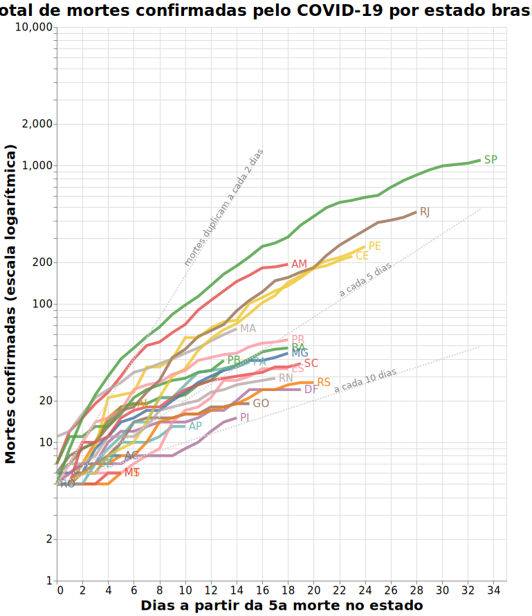

# Visualização de dados relacionados ao COVID-19 no Brasil
Visando entender o comportamento da evolução da COVID-19 no Brasil, esta página apresenta o ritmo de aceleração ou desaceleração da doença por estado brasileiro. A inspiração para criação desta visualização veio a partir do gráfico publicado pela organização <a target="_blank" rel="noopener noreferrer" href="https://ourworldindata.org/grapher/covid-confirmed-deaths-since-5th-death">Our World in Data</a> que tem como objetivo apresentar não somente o número de casos mas também o ritmo no qual as morte estão ocorrendo.

## Sobre os dados 
É importante salientar que esta visualização se baseia em dados disponibilizados pelas secretarias estaduais, coletados de forma manual uma vez que não há um banco de dados integrados, conforme site <a target="_blank" rel="noopener noreferrer" href="https://brasil.io/dataset/covid19/caso">Brasil.io</a>. São dados passível de erros e vieses portanto qualquer análise não deve ser baseada somente nestes dados e toda tomada de decisões deve considerar uma análise científica com informações complementares.

## Número de mortes por estado brasileiro a partir da 5a morte notificada

<a target="_blank" rel="noopener noreferrer" href="https://vega.github.io/editor/#/url/vega-lite/N4KABGBEDGD2B2AzAlgc0gLjMSA3ZApgO6bYwIAuy8ArrDQM4DqyAJhQBakAsADLwBooceFVr0GACQJoOFUgGZ+AX2UDwUADYBDAJ4EATqQDaGiKAiWoAW20GA1qRwVdABwKlIm6h6GRYrtrQyC6kvAB0AOx+DBQGsPYELOxcWNxqZpaQBPBwrNToWBZWWXCasEZFmSXCCPlUCE7VNVAu7p7wsNbU2pqQ6i0lkCgEmqyesdoUvs01kAyjBNAN8BOLyxX8AGyQs5YZgxB4vTQeWF6yFKgGeruDBy2QFLCwmlSuJnvmT25nUJ3deC9fpQEZjCYUKYeB6DZy-DpdHp9Pxg8bnAAiUJBT2Q1gIAFV4CFPPo7NZKBxWFiYS04e1zgCkdjUZ50QQphwGJBlHsALoDR4ADycP3pUAAjjRtKIQlNkLhfKDCOCMbcaVZILomodWvDzpLpVRIVQFf0vkrRmioGyOVyBYN5tBen86X8vLB0Dz7s11VAODJUHJSFsAKyCZrzdYrEULTRLZ4GbYitpuhgFOPM5WsLlYYzzY0eXmqe1ZI0Z84AFVgkM0YFYBDA5IM0wYYBEKAMtiprfc5TAAGEAPIANQAkuiALQARgAnGBXBUwARJqxYGAAEY3NNx5DxO0RohsTikAAc-EyNOKGtsDmTeq0PmxASCIS1WAi0SgsXiiWSx7SvrZLksD5PAhTYHs5DlJUZApgigLAiiWYQtSJYas+wShEUxyaKcYThCGvpHMK2FwfqUoysa8qKsMyGqlqRFQG+EE6qKboGpRcqmmhQwshi7KcPurEME65awfe7qensXolIB-qXMGYY8TiFBiZAVY1nWDZNi2bYIB2XbaD2oxrkOY6TrO86LsukKrhuW7IDue5mnMcTSgwiAVNYJg4CgbyGDGUbII05yxvGmy8Dsqj8geR6pGAZ68BeJZXlkN6OKREnTIK8h+L0aCrOccaILlUCsCRYAhjEyAAF5-FOvCATkeQFNqjxlBUd5ipAjJAsiFoql+BbYnGqA5FatCaJojFPAQOVdW6vWIQNVr5qhkEValrkSRxRpcTMrHaKg1wEKgWLnLYwo8Rq2iCsgOawSEanosgRlgNo852FQBh1h9IYfTpDadEuK6wNy11ZHx1q3NJEOam1DpkRKFF7SaB2HJAR0nWd0winYqCXayaoQ0ct33cmT1ugAshUuntruhmtgAFMuokfeUZ0GAAtxQ3ROgAlOD5q0ZarICZydwtDJVhyQGQZYKG4auZTngab0WmNrTy56UgDPaN284mQOI7jtOc4Lj9Nn62um5GY5MjOcpbnwB5Xk+bR-kwTgYXLMFhVflGEVRcoMVzIeKSnueMsaKHZVTNoIpAninhUpCE7QOurAnls3CIDOrDQIgCgEAATAorBbIgvCsEorDcOuCjQEsJdTiGQtHAAJCJ-q2J4cgUK4DAYAA9MPCpneEqAhBwNDruEwXD93BC2GPp3aBO3jTGP3DhCe4RTuEABWDCNAKkCp0ZBAUA9qXn-H6eZ9nuf54XxdlxXVc19X9eN83refDUHAmJmKCCGudKAABBKm2IbSCVIJ+SAmJcbnBLrwVBE5eDcAwQoCs-AMB4P4O3EoQDbhYCnDEYa5woEwPFg9KcJc-BILdKg9BmCMHcFwbwfBXDCG+hIcxBhYDkGQOgYw2hpBW6MPAZAFhvB2EYJDJw7h3CiFWH4YoCh0jqFiNtBImcUjhEyLQXIthkUlEEN4Koyw6i0iaMMdo604isBlwMcw4x8jeCRHMTwyxfDEGkMqnYt0DjEFOLAEoVxnhZEeJPN4lRfjgHBiCZ4EJsCJZpFAf4wx0TTEzjibwniNiwAIMmPY0RjjdFYCUtDbJ7i2ENXyb4wp-iQHJPOAAIQgTQypYAtiRJQXUrBvAcEWPic0xJZC2lQE6d0uBWAEFMKiYM9hjSrHfAmWAQRa1DEzJ0XMsA+ialuNYUMxRoyCnNCKQoKZkBdkVP2Q1fpUAclDK2KshJATuA3LuaEnpU4vlHKWScjBXjzlNMuS00gVUhFuh+WkuhJ4nlGOBbwWJYK1lkA2X0mFng4VhNnEil5GC8noo+cxEplDpldL2eksABLAUDOBQ00l4yAmZNKW6fsABRWZtLoVZOOSYhQE4S4kp8WMiFGzyE4vONy3lD1+WLMZUKicSh3msoETcuVNKHoLOkTk4VCgpzqslQE65MqoDavubSw5AqgUmKGcallprmIAu2ZynlOrSAt0JcstBJrAGQqqVqz11qHoly2Uq55fqRniouYGrFIb5XevNXa5VHiOHOoTQEil0irW-P2QoRV+q-VnLjeC7NzFEUWsgPm+Fihi21JRW8rNxCg0HKTV6jJvqUWgvLRiopjya11rCSGPVTaHUYLRf2slEjpXus8COnpY6e2Tt4GK5R8a21Sq2RyxdoaC20q2OOwV8jmUzo1WEG56IABiybg0MujSikuAbt0BPnXujEd6u29NXR42Nm6K1vs1TW2997il-tMZmi9LqNGge-WG+BkHTmvrUe2t1n7rQIcPXQzJUbkVrpbTBytULr3YfrWQyNJbe2oese27FC6v3gfochqdtH1k5rI8x1N+GiXrvY5igJ1bGNYeY263jyzz2AYHe29llLIBcoAMrgcbae0xAGLEyalTcpT4GGMSZRdB6Ts7nE6eUz+-T1G11luM5erAqbMMKfM4hhWrGzGtrQxsjD8ndMWbc322zsGH0iac3ptz07AskdczW3zLmIOPoIx4jdmmTPxZC7FnDp5WNSZS3ZsAcnpEAHFBwqbc0RyLwGJE3OK6VhLfGAu5aC5s6rJWf0nvtTEgTVyWvgfa+m3JXX0M9Z-cJgzk6cs+K02ym5VNqVxanPOsbHiGuTdSx++Ts3mNUYnZ1jzdGNm7o23NzLZDLM7YG3tjjzEHNHfAz6urkneCDY2QVwxVNCthYeyijTq28vreke9z7aan1rqM41qLzWa2A78196zz2zUzY+z+21S3THlfB5V2xUOkfzcW1Z5b8PmL8sc9D+b4n8emIixjzzASGMk5xydulqmOsXeI5jtL9PmN9ZB2ep7l3BOtJrQABWOxRwJsOPHo9+01-7hiRe1eB4l0xK2JUQ8O9I+XMPFd8ap9LiHN2Nei7CdzpXQzkt6-Z95w34GUcU6wRN1X7PXtuiF+03r4XCdVeF27n9C23Pm8dzTkDIXXfMbx+d+3fO2dB6vcLg9Yvmf9eFSXXXgf9vvpuUL+Po7IPJ4D1umPpm49A9R4aqPFXC-hMz9nnpZ21OGqddH9Prrq-gdG3bjBjeK-N9I8X5HbmX386KXT+TWfmN4Y78Mz38zW++-JxHlZQ-23Ccc2Pn993telunx2vvcWIkS7R9vodIea+Fvn2poZKuC897IbLl3p-aXcDryzoZqfr9XYkeruXD+FXP-62bo-A3b-PTRPHnepcvanG-fLTPUcBXVHS-I-GAkvSfN-IDSvL-F3WAtrf3bfIAzA93A-SPbfZ3TwIXAAJTgMnx+zTw-0mWFwoOwMIMXyb1oMhxDwYPmwnwX14Bs0gNYLwNII4MZ3+TK23ytzlyELF0kSYM8W32J1H0kPxRNx123xHw10UJ6RLnPxf2JW31zQkLuz-zAKIKXxexuTIIAClkDztk8wcLdK879PBLC29c8RVeD7CoCMCnCrD+8D9k8pcaCBc4MQtnDfcuD68RUr80CoDxC3RQj5seMKdk9UCpsidzCfD5tlC6k89VD0jmN28bDVUICPDWD9C4iMjGcXE-DVUu8+CgisAV95N4jKiCiL9O9t9bVHNmixduBw82j-VTD30SDzhuiwluAsjvsj9HCRiKiE9WidDMEj8vCZi9NtD-8FFAC8i2s+iFiAj396i6VYjvC29bduCojUiJF5DpFRi-lIoPdBjmIpw1DDEbiHkI0cCHiJEyjji58JjxtijAiilhioAyCAA5aw-ouwwE9taYkE8ExgzfFFdw6Eg7cw+EuLP4yXXAtElwmQ841LI4kY9E4QnY9Y1FOQnE33Uk4w3Qz46LEI4kqQ6k03acAE-YoE8w5zRnUAlk3gWokog42EyAMgrkhPAfbfZYkE0UsJIw3k6g9k9tAQkY6UnpTEqDMQzkggxEuHOk8XEIlU-ZeYskvY6I1g54uIg02lI0mk2Q3U745U8fe4lgg4xo64y0uhNYm0-PU0g4zopo90y47LNkn0jkmtRTfsSg7gwfZ0wdG5cMyM-o+UkM9tSUyAeMsItzKEhUjZJUqAdMzgtzZE7Mz5OMiMqk0Q3Uq4wxfM4Qnk+rXIsMsszIp07vUo0s-Ij4mM5fds33a0lkh3YswXELRTIXBMlnYVWcRAsM0c3w7U7BEVYMi4ovYcmc+bOs7IkVfklEhHacu7bbCIiNDU3cn9ffOc4ZEVJMpcvUxzEc8DPgVwrQhslcu8vsg1NwvQuM1c7k18jckuE0q8106sr8sXLYH81hZPfEvLP06RW8kbT0pXZIo-YEtM4CsJGcMClVUVKYz8sPRIwotVXUljY8hI2Ut8o1TY4i4QnONzLcwciRQkvM1Cv5E8DCjxaM1swUqst0WCuLFuU4xMo-c0zwHiyorYcIhYrM5MqVe0xiu7SIdcpEo-QC7ipiwtTBCsrsqVaCoC8DBQSIZk+s3U1BHCn9bgFPFsuoopDfG81Sx-GcUiv1b0q894yihPe8pggc3xTIXkDQHkZQIAA/view">-> CLIQUE AQUI para abrir gráfico interativo</a>

## Considerações
O único tratamento nos dados originais foi o preenchimento dos números faltantes, provavelmente devido à falta de disponibilidade de informação oficial pela secretaria em um determinado dia, porém não acontece com frequência. Os dados pendentes foram preenchidos com o mesmo número total de mortes válido antes daquele dia para aquele estado. Normalmente esta lacuna ocorre nos dias mais recentes portanto, para fins de visualização, não foram considerados os últimos 2 dias. Como o intuito deste gráfico é mostrar a tendência é importante termos os dados completos para não tirarmos conclusões precipitadas.

## Referências

* <a target="_blank" rel="noopener noreferrer" href="https://brasil.io/dataset/covid19/caso">Brasil.io</a>
* <a target="_blank" rel="noopener noreferrer" href="https://ourworldindata.org/grapher/covid-confirmed-deaths-since-5th-death">Our World in Data</a>
* <a target="_blank" rel="noopener noreferrer" href="https://www.facebook.com/726282547396228/videos/861466570947781/">DataCamp Live Coding: Covid-19 Exploratory Data Analysis</a>
* <a target="_blank" rel="noopener noreferrer" href="https://matthewkudija.com/blog/2018/06/22/altair-interactive/">Altair: Interactive Plots on the Web</a>

---

- *Atualizado em: 13/04/2020*
- *O código original para geração desta visualização pode ser acessado aqui: <a target="_blank" rel="noopener noreferrer" href="https://github.com/fehann/COVID-19-Brazil/blob/master/covid19estadosbrasileiros.py">Python</a>.*
- *Cuidem da saúde e da familia, colaborando vamos sair desta situação o mais breve possível.*

<!---
Para atualizar o gráfico:
1) Google Colab - rodar o notebook
2) Salvar imagem em SVG e substituir no Github
3) Abrir no editor do Vega Lite e copiar link para Github
-->
